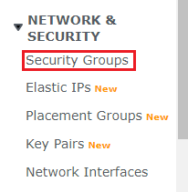
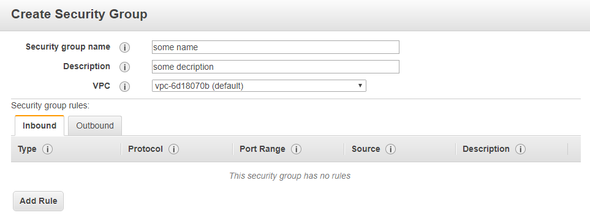
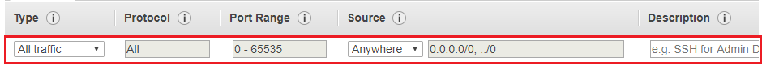
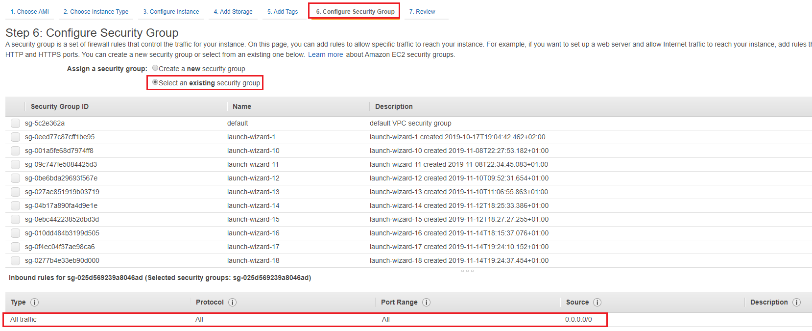
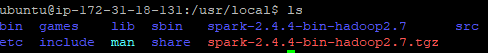
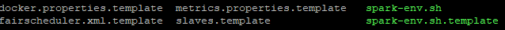

# Deploying the Spark cluster including two nodes - master and slave. 

This tutorial is based on: https://blog.insightdatascience.com/spinning-up-a-spark-cluster-on-spot-instances-step-by-step-e8ed14ebb3b and https://github.com/mrkjankowski/Tutorials.git

## The first prerequisite is learning some basic Linux commands to make the system easier to navigate. Below I enlist some which I'm personally using whenever I work with Ubuntu without GUI.

- "ls"  will list files and directories.
- "cd" will always put you in your home directory.
- "cd .." will move you up one directory.
- "cd -" will switch you to the previous directory. 
- when typing in the Linux command line, use **TAB** to autocomplete commands, filenames or folder names.

## The second prerequisite is configuration of "Security Groups". You can find that section on the EC2 Dashboard.



1. Enter the "Create Security Group", then name the security group as you like and hit the "Add Rule".



2. Select options as follows and save your security group. <u>You will use it whenever you launch an instance from AMI.</u>



3. While either creating or launching an instance from AMI remember to go to the "Configure Security Group" section and to select the very existing security group that you've created.



## **Installing Spark on each node

Before downloading Spark package, make sure you updated & upgraded Ubuntu.

```bash
$ sudo apt-get update
$ sudo apt-get upgrade 
$ wget http://ftp.man.poznan.pl/apache/spark/spark-2.4.4/spark-2.4.4-bin-hadoop2.7.tgz
```

Now we will move downloaded package to another directory using mv command. 
The syntax is clear: $ *mv file_name destination_name*. In my case it's /usr/local/.

```bash
$ sudo mv spark-2.4.4-bin-hadoop2.7.tgz /usr/local/
```

Navigate to the /usr/local/ directory. Use tar xvzf file_name for uncompressing:

```bash
usr/local$ sudo tar xvzf spark-2.4.4-bin-hadoop2.7.tgz
```

The result after typing ls command should look like below:



## Basic configuration for any node

Add the Spark environment variables to ~/.profile and source it to the current shell session.

```bash
usr/local$ export SPARK_HOME=/usr/local/spark
usr/local$ export PATH=$PATH:$SPARK_HOME/bin
usr/local$ . ~/.profile
usr/local$ sudo chown -R ubuntu $SPARK_HOME
```

Then, we have to install Java and Scala by pasting:

```bash
usr/local$ sudo apt-get -y install openjdk-8-jdk-headless
usr/local$ sudo apt-get install scala
```

Let's now move into the spark 2.4.4 configuration directory.

```bash
usr/local$ cd spark-2.4.4-bin-hadoop2.7
usr/local/spark-2.4.4-bin-hadoop2.7$ cd conf
```

Now, we will copy the template and rename it simultaneously using only cp command. The syntax looks like this: $ *cp source_name directory_name*

```bash
usr/local/spark-2.4.4-bin-hadoop2.7/conf$ 
cp $SPARK_HOME/conf/spark-env.sh.template $SPARK_HOME/conf/spark-env.sh
```

If you type basic *ls* command it should look like this:



It's almost done, now we have to change the spark-env.sh file on each of our nodes (e.g. the master node and one slave node). I prefer using vim editor, but it's up to you which one you choose. 

```
usr/local/spark-2.4.4-bin-hadoop2.7/conf$ vim spark-env.sh
```

We have to paste just two lines on the beginning of the file:

*export JAVA_HOME=/usr*
*export SPARK_PUBLIC_DNS=”**current_node_public_dns**”*


Type *:wq* to write and close the file simultaneously.

## Configuration for master node

In the end you have to create an empty file that contains public DNS of slave nodes. 

```bash
usr/local/spark-2.4.4-bin-hadoop2.7/conf$ touch $SPARK_HOME/conf/slaves
```

Obviously the result is:


Let's use vim editor one more time and just paste public DNS, then save & quit.


##  Launching the cluster.

Before you SSH into the master node, forward the port as follows:

https://github.com/OskarBienko/Photos/blob/master/image-20191203173901525.png?raw=true

Use below commands **only on master node**. As always, pay attention to type commands while in the right directory.

```bash
usr/local$ ./spark-2.4.4-bin-hadoop2.7/sbin/start-master.sh
```

After typing localhost:8001 into web browser the output should look like below.
Copy the highlighted URL so that you can launch a worker.


To connect your slave you just need one more command:

```bash
 usr/local$ ./spark-2.4.4-bin-hadoop2.7/sbin/start-slave.sh spark://ip-172-31-18-131.eu-west-1.compute.internal:7077
```


To turn off your master and slaves servers, use either:

```bash
usr/local$./spark-2.4.4-bin-hadoop2.7/sbin/stop-all.sh
or
usr/local$ ./sbin/stop-master.sh
usr/local$ ./sbin/stop-slave.sh
```

To sum up, I recommend creating two AMIs: 

-  master node, which is basically a slave node but contains **slaves file** and **configurated Jupyter environment**
- slave node 


